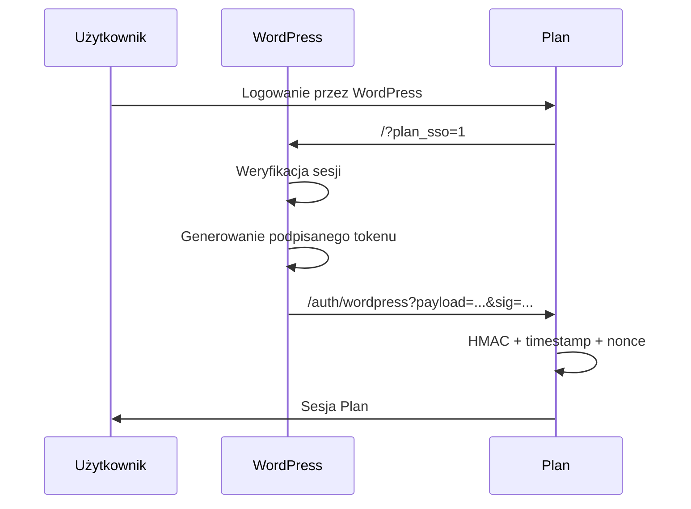

# Plan WordPress SSO

Samodzielny plugin WordPress, w którym WordPress pełni rolę dostawcy tożsamości dla aplikacji [Plan](https://github.com/chmajster/plan).

Plugin nie implementuje OAuth2, OpenID Connect, JWT ani SAML. Korzysta z prostego kontraktu SSO zgodnego z aktualną aplikacją Plan: `Base64URL(JSON)` podpisany przez `HMAC-SHA256`.

## Wymagania

- WordPress >= 6.0
- PHP >= 8.0
- aplikacja Plan z włączonym WordPress SSO
- wspólny sekret SSO wygenerowany po stronie Plan
- HTTPS w środowisku produkcyjnym

Plugin podczas działania produkcyjnego nie wymaga Composera ani katalogu `vendor`.

## Instalacja

### Instalacja z ZIP

1. Pobierz lub zbuduj `plan-wordpress-sso.zip`.
2. W WordPress otwórz **Wtyczki → Dodaj wtyczkę → Wyślij wtyczkę na serwer**.
3. Wskaż `plan-wordpress-sso.zip`.
4. Zainstaluj i aktywuj plugin.
5. Otwórz **Ustawienia → Plan WordPress SSO**.

Po rozpakowaniu główny plik musi znajdować się pod:

```text
wp-content/plugins/plan-wordpress-sso/plan-wordpress-sso.php
```

### Instalacja ręczna

Skopiuj zawartość repozytorium do:

```text
wp-content/plugins/plan-wordpress-sso/
```

Następnie aktywuj **Plan WordPress SSO** w panelu WordPress.

## Konfiguracja

Panel administracyjny znajduje się w:

```text
Ustawienia → Plan WordPress SSO
```

Dostęp wymaga capability:

```text
manage_options
```

Skonfiguruj trzy wartości.

### Adres aplikacji Plan

Przykład:

```text
https://plan.example.org
```

Adres jest zapisywany bez końcowego `/`. HTTP jest obsługiwane dla środowisk lokalnych/testowych, ale panel pokazuje ostrzeżenie. Produkcyjnie używaj HTTPS.

### E-mail administratora/właściciela Plan

Przykład:

```text
admin@example.org
```

E-mail jest normalizowany do lowercase. Jeżeli użytkownik WordPress mapuje się na rolę `admin`, jego bieżący e-mail musi być identyczny z tą wartością.

### Wspólny sekret SSO

Sekret musi zostać wygenerowany przez aplikację Plan i mieć format:

```regex
^[a-fA-F0-9]{64,128}$
```

Sekret jest używany jako tekstowy klucz HMAC dokładnie w zapisanej postaci. Plugin nie wykonuje `hex2bin()` i nie zmienia wielkości liter.

Po zapisaniu pełna wartość sekretu nie jest renderowana w HTML. Przy kolejnym zapisie:

- puste pole zachowuje istniejący sekret,
- nowa poprawna wartość zastępuje sekret,
- błędna nowa wartość jest odrzucana.

## Role

Przy aktywacji plugin tworzy:

| WordPress | Nazwa | Plan |
|---|---|---|
| `plan_volunteer` | Plan — Wolontariusz | `volunteer` |
| `plan_leader` | Plan — Leader | `leader` |
| `plan_deputy` | Plan — Zastępca | `deputy` |
| `administrator` | standardowa rola WordPress | `admin` |

Plugin nie tworzy roli `plan_admin`.

Priorytet przy wielu rolach:

1. `administrator`
2. `plan_leader`
3. `plan_deputy`
4. `plan_volunteer`

Użytkownik bez obsługiwanej roli otrzymuje HTTP 403.

Dezaktywacja i uninstall nie usuwają kont użytkowników ani ról, aby nie zmieniać istniejących uprawnień użytkowników. `uninstall.php` usuwa wyłącznie opcję konfiguracji pluginu.

## Rozpoczęcie SSO

Endpoint inicjujący:

```text
https://wordpress.example.org/?plan_sso=1
```

Jeżeli `plan_sso` ma inną wartość niż `1`, plugin nie ingeruje w request.

Jeżeli użytkownik nie jest zalogowany, zostaje przekierowany do standardowego `wp-login.php`. Parametr `redirect_to` prowadzi z powrotem do `/?plan_sso=1`, więc po poprawnym logowaniu proces SSO jest automatycznie kontynuowany.

Plugin nie implementuje własnego formularza hasła.

## Shortcode

Domyślny przycisk:

```text
[plan_sso_button]
```

Własna etykieta:

```text
[plan_sso_button label="Przejdź do aplikacji"]
```

Dla użytkownika niezalogowanego przycisk prowadzi do `wp-login.php` i wraca do SSO po logowaniu.

Dla zalogowanego użytkownika z obsługiwaną rolą przycisk prowadzi do `/?plan_sso=1`.

Dla zalogowanego użytkownika bez obsługiwanej roli renderowany jest nieaktywny element zamiast linku SSO.

Etykieta jest sanityzowana i escapowana przed wyrenderowaniem.

## Protokół SSO

Przepływ:



### Payload

Logiczny payload:

```json
{
  "owner": "owner@example.org",
  "email": "user@example.org",
  "previous_emails": [
    "old@example.org"
  ],
  "role": "volunteer",
  "ts": 1780000000,
  "nonce": "..."
}
```

Pola:

- `owner` — e-mail właściciela Plan z konfiguracji pluginu,
- `email` — bieżący e-mail użytkownika WordPress, lowercase,
- `previous_emails` — maksymalnie 5 poprzednich poprawnych e-maili, newest first, bez bieżącego adresu i bez duplikatów,
- `role` — `admin`, `leader`, `deputy` albo `volunteer`,
- `ts` — wynik `time()`,
- `nonce` — losowa jednorazowa wartość generowana przez `random_bytes()` i kodowana Base64URL.

Plan akceptuje token tylko przez krótki czas, około 120 sekund, i odrzuca ponownie użyty nonce.

### JSON

Payload jest kodowany przez `wp_json_encode()` z flagami:

```php
JSON_UNESCAPED_UNICODE | JSON_UNESCAPED_SLASHES
```

### Base64URL

JSON jest kodowany do Base64URL:

```text
+ -> -
/ -> _
końcowe = są usuwane
```

Podpis jest liczony nad zakodowanym payloadem, nie nad surowym JSON.

### HMAC-SHA256

Podpis:

```php
hash_hmac(
    'sha256',
    $encodedPayload,
    $sharedSecret
)
```

Wynik to lowercase hex SHA-256 o długości 64 znaków.

Sekret jest używany jako tekstowy klucz dokładnie w zapisanej postaci.

### Redirect do Plan

Końcowy adres:

```text
{PLAN_URL}/auth/wordpress?payload={URL_ENCODED_PAYLOAD}&sig={URL_ENCODED_SIGNATURE}
```

Plugin nie przyjmuje od użytkownika parametrów `redirect`, `callback` ani `return`. Docelowy scheme, host i port są sprawdzane względem zapisanej konfiguracji `plan_url`.

## Historia zmian e-maila

Plugin korzysta z user meta:

```text
_plan_sso_email_history
```

Hook `profile_update` wykrywa zmianę e-maila, również gdy wykonuje ją administrator.

Historia:

- maksymalnie 5 pozycji,
- newest first,
- lowercase,
- tylko poprawne e-maile,
- bez duplikatów,
- bez bieżącego adresu.

Dzięki `previous_emails` aplikacja Plan może zachować powiązanie konta po zmianie e-maila w WordPress.

## Bezpieczeństwo

Plugin:

- nigdy nie przekazuje do Plan hasła ani cookie WordPress,
- nie tworzy endpointu do sprawdzania haseł,
- nie ujawnia sekretu w HTML, JS, logach ani query string WordPress,
- zapisuje konfigurację przez WordPress Settings API z nonce,
- escapuje wartości renderowane w panelu i shortcode,
- nie tworzy własnych tabel SQL,
- używa wyłącznie `wp_options` oraz `wp_usermeta`,
- generuje nonce przez `random_bytes()`,
- podpisuje `Base64URL(JSON)` przez HMAC-SHA256,
- sprawdza rolę i bieżący e-mail użytkownika,
- dla `admin` wymaga e-maila identycznego z owner e-mailem,
- nie implementuje callback URL kontrolowanego przez użytkownika,
- ogranicza redirect do hosta skonfigurowanego w `plan_url`.

## Testy developerskie

Instalacja narzędzi:

```bash
composer install
```

PHPUnit:

```bash
composer test
```

PHPCS:

```bash
composer phpcs
```

Syntax check:

```bash
find . -name '*.php' -print0 | xargs -0 -n1 php -l
```

Testy obejmują:

- Base64URL,
- mapowanie i priorytet ról,
- HMAC,
- walidację sekretu,
- normalizację e-maila,
- normalizację historii e-maili,
- budowanie payloadu,
- format nonce.

## GitHub Actions

Workflow `.github/workflows/tests.yml` uruchamia testy dla PHP:

- 8.0
- 8.1
- 8.2
- 8.3
- 8.4

Po przejściu testów osobny job buduje `plan-wordpress-sso.zip` jako artifact. ZIP nie zawiera `vendor`, testów ani plików developerskich wymaganych wyłącznie do CI.

## Troubleshooting

### HTTP 500: plugin nie jest poprawnie skonfigurowany

Sprawdź:

1. URL Plan,
2. owner e-mail,
3. sekret SSO i jego długość.

Sekret nie jest ujawniany w komunikacie błędu.

### HTTP 403: brak obsługiwanej roli

Nadaj użytkownikowi jedną z ról:

```text
administrator
plan_leader
plan_deputy
plan_volunteer
```

### HTTP 403 dla administratora

Bieżący e-mail administratora WordPress musi być identyczny z owner e-mailem skonfigurowanym w pluginie.

### Plan odrzuca podpis

Sprawdź, czy WordPress i Plan używają dokładnie tego samego sekretu. Nie konwertuj sekretu przez `hex2bin()` i nie zmieniaj wielkości liter.

### Token wygasł

SSO powinno zostać rozpoczęte ponownie. Plan odrzuca tokeny starsze niż około 120 sekund.

### Użytkownik zmienił e-mail i nie może się zalogować

Sprawdź user meta `_plan_sso_email_history` i upewnij się, że poprzedni e-mail nadal jednoznacznie identyfikuje właściwego wolontariusza w Plan.
